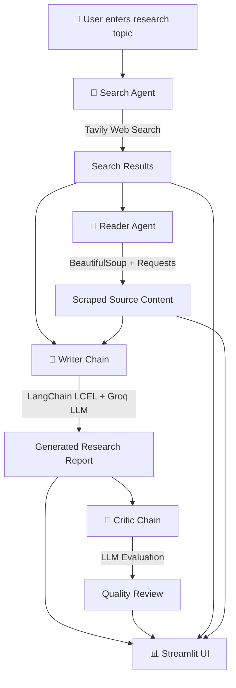

# 🤖 Multi-Agent AI Research System

> An autonomous multi-agent research pipeline that searches the live web, extracts source knowledge, generates a structured research report, and automatically evaluates the final result.


---

## 📌 Overview

The **Multi-Agent AI Research System** is an AI-powered research application designed to automate the process of researching a topic from multiple stages.

Instead of asking a single LLM to directly generate an answer, the system separates the task into specialized components:

```text
User Topic
    ↓
Search Agent
    ↓
Reader Agent
    ↓
Writer Chain
    ↓
Critic Chain
    ↓
Final Research Report + Quality Review
```

Each stage has a specific responsibility, creating a more structured and controllable research workflow.

The project also includes a futuristic **Streamlit frontend** that visualizes the research pipeline and displays the generated report, critique, search results, and scraped source content.

---

# 🧠 Architecture

The system follows a sequential multi-agent architecture.



### Architecture Components

### 1. Search Agent 🔎

The Search Agent is responsible for finding recent and relevant information from the web.

It uses:

* **LangChain Agent**
* **Tavily Search API**

The agent receives the research topic and searches for useful sources, returning titles, URLs, and snippets.

```text
Topic
  ↓
Search Agent
  ↓
Tavily
  ↓
Relevant web sources
```

---

### 2. Reader Agent 📖

The Reader Agent takes the search results and identifies a useful source to investigate more deeply.

It uses:

* `requests`
* `BeautifulSoup`
* LangChain tool calling

The webpage is downloaded, unnecessary elements such as scripts, styles, navigation, and footers are removed, and useful text is extracted.

```text
Search Results
      ↓
Relevant URL
      ↓
Requests
      ↓
BeautifulSoup
      ↓
Clean source text
```

---

### 3. Writer Chain ✍️

The Writer Chain combines:

* Search results
* Scraped source content
* Research topic

and sends them to the LLM using a structured prompt.

The generated report follows:

```text
Introduction
      ↓
Key Findings
      ↓
Conclusion
      ↓
Sources
```

The chain is implemented using **LangChain LCEL**:

```python
writer_chain = writer_prompt | llm | StrOutputParser()
```

This helped me understand how modern LangChain chains can be composed as a pipeline instead of manually managing every LLM call.

---

### 4. Critic Chain 🧠

The Critic Chain evaluates the generated research report.

It checks the report for:

* Strengths
* Weaknesses
* Areas for improvement
* Overall quality score
* Final verdict

The output follows:

```text
Score: X/10

Strengths:
- ...
- ...

Areas to Improve:
- ...
- ...

One line verdict:
...
```

This creates a second AI perspective instead of blindly trusting the generated report.

---

### 5. Pipeline Orchestrator ⚙️

`pipeline.py` coordinates the complete workflow.

The shared state is stored in a Python dictionary:

```python
state = {}
```

The pipeline progressively stores:

```text
state["search_results"]
state["scraped_content"]
state["report"]
state["feedback"]
```

This makes the flow between agents simple and easy to debug.

---

### 6. Streamlit Frontend 🚀

The frontend provides an interactive research dashboard.

The UI includes:

* Futuristic AI visualization
* Agent pipeline display
* Research command interface
* Live execution status
* Research report
* AI critique
* Search results
* Scraped source content

The architecture therefore has both a backend intelligence layer and a user-facing presentation layer.

---

# 🔄 Complete Workflow

When a user enters a topic, the system executes the following sequence:

```text
┌───────────────────────────────────────┐
│           User Research Topic         │
└────────────────────┬──────────────────┘
                     ↓
┌───────────────────────────────────────┐
│             SEARCH AGENT              │
│          Tavily Web Search            │
└────────────────────┬──────────────────┘
                     ↓
┌───────────────────────────────────────┐
│             READER AGENT              │
│      Requests + BeautifulSoup         │
└────────────────────┬──────────────────┘
                     ↓
┌───────────────────────────────────────┐
│             WRITER CHAIN              │
│        LangChain + Groq LLM           │
└────────────────────┬──────────────────┘
                     ↓
┌───────────────────────────────────────┐
│             CRITIC CHAIN              │
│        AI Quality Evaluation          │
└────────────────────┬──────────────────┘
                     ↓
┌───────────────────────────────────────┐
│          STREAMLIT DASHBOARD           │
│ Report + Critique + Sources           │
└───────────────────────────────────────┘
```

---

# 🛠️ Technology Stack

## Programming Language

**Python**

Used for:

* Agent implementation
* API integration
* Web scraping
* Pipeline orchestration
* LLM interaction

---

## AI / LLM

### LangChain

Used for:

* Building agents
* Tool calling
* Prompt templates
* LCEL chains
* Connecting the application components

Important concepts learned:

```text
Agents
Tools
ChatPromptTemplate
LCEL
Output Parsers
Agent Invocation
State Passing
```

### Groq

Used as the LLM provider for fast model inference through:

```python
ChatGroq
```

---

## Web Search

### Tavily

Used by the Search Agent to retrieve live web information.

```text
Research Topic
     ↓
Tavily API
     ↓
Search Results
```

---

## Web Scraping

### Requests

Used to retrieve webpage content.

### BeautifulSoup

Used to extract and clean readable text from webpages.

---

## Frontend

### Streamlit

Used to create the interactive research dashboard without building a separate React frontend.

The interface includes custom HTML and CSS for the futuristic AI-themed design.

---

## Environment Management

### python-dotenv

Used to load API keys securely from `.env`.

Example:

```env
GROQ_API_KEY=your_key_here
TAVILY_API_KEY=your_key_here
```

API credentials are excluded from Git using `.gitignore`.

---

# 📚 What I Learned

This project was built to move beyond basic LLM API calls and understand how an actual AI application can be structured.

### 1. Building AI Agents

I learned how to create tool-using agents with LangChain.

Instead of:

```text
User → LLM → Answer
```

I implemented:

```text
User
 ↓
Agent
 ↓
Tool
 ↓
External Information
 ↓
LLM
```

---

### 2. Tool Calling

The Search Agent and Reader Agent use specialized tools.

Examples:

```python
@tool
def web_search(query: str):
    ...
```

and:

```python
@tool
def scrape_url(url: str):
    ...
```

This taught me how LLMs can interact with external systems instead of only generating text.

---

### 3. LCEL

I learned how to compose LangChain operations using the pipe operator:

```python
writer_chain = writer_prompt | llm | StrOutputParser()
```

This helped me understand **LangChain Expression Language (LCEL)** and composable AI workflows.

---

### 4. Multi-Agent Architecture

I learned that complex AI tasks can be divided into specialized responsibilities.

Instead of one large prompt doing everything:

```text
Search + Read + Write + Evaluate
```

I created separate stages:

```text
Search Agent
      ↓
Reader Agent
      ↓
Writer Chain
      ↓
Critic Chain
```

This makes the application easier to understand, debug, and extend.

---

### 5. State-Based Pipeline Design

I learned how to pass information between different processing stages using shared state.

```python
state = {}

state["search_results"] = ...
state["scraped_content"] = ...
state["report"] = ...
state["feedback"] = ...
```

This gave me practical experience with workflow orchestration.

---

### 6. Web Scraping + AI

The project combines traditional software engineering with AI.

```text
HTTP Requests
      +
HTML Parsing
      +
LLM Processing
      =
AI Research Pipeline
```

This helped me understand how AI applications can consume real-world external data.

---

### 7. AI Evaluation

I learned that generating an answer and evaluating an answer are two separate problems.

That led to the Critic Chain:

```text
Generate Report
      ↓
Evaluate Report
      ↓
Find Weaknesses
      ↓
Improve Quality
```

This is an important pattern for building more reliable LLM applications.

---

### 8. Building an AI Product UI

I also learned how to turn an AI backend into a usable application.

The Streamlit interface connects the backend pipeline to a visual research dashboard.

---

# 🎯 Problem Solved

Traditional AI chat applications often follow:

```text
User Question
      ↓
LLM
      ↓
Generated Answer
```

This approach can make it difficult to:

* Gather current information
* Inspect original sources
* Separate research from writing
* Evaluate the generated result
* Understand how the final answer was produced

This project addresses those problems by creating a dedicated research workflow.

### The solution

```text
Live Web Search
      ↓
Source Extraction
      ↓
AI Report Generation
      ↓
AI Quality Evaluation
```

The system provides the user with not only a final report, but also the underlying search results, extracted source content, and an independent critique.

---

# 💡 Why This Project Matters

This project demonstrates practical experience with **agentic AI application development**.

It goes beyond simply calling an LLM API and demonstrates how to build a system where multiple AI components work together with external tools.

The project combines:

```text
LLMs
+
Agents
+
Tool Calling
+
Web Search
+
Web Scraping
+
Prompt Engineering
+
LCEL
+
Pipeline Orchestration
+
AI Evaluation
+
Frontend Development
```

---

# 📁 Project Structure

```text
MULTI AGENT AI SYSTEM/
│
├── agents.py
│   └── Search Agent, Reader Agent, Writer Chain, Critic Chain
│
├── tools.py
│   └── Tavily search tool and webpage scraping tool
│
├── pipeline.py
│   └── Main multi-agent workflow orchestration
│
├── app.py
│   └── Streamlit frontend
│
├── requirements.txt
│   └── Python dependencies
│
├── .env
│   └── API credentials (not committed)
│
├── .gitignore
│   └── Ignored files and secrets
│
└── README.md
    └── Project documentation
```

---

# ⚙️ Installation

Clone the repository:

```bash
git clone https://github.com/PriyanshuYadav000/multi-agent-ai-system.git
cd multi-agent-ai-system
```

Create a virtual environment:

```bash
uv venv
```

Activate it:

### macOS / Linux

```bash
source .venv/bin/activate
```

Install dependencies:

```bash
uv pip install -r requirements.txt
```

---

# 🔐 Environment Variables

Create a `.env` file:

```env
GROQ_API_KEY=your_groq_api_key
TAVILY_API_KEY=your_tavily_api_key
```

Never commit your `.env` file.

---

# ▶️ Run the Application

### Run the research pipeline from terminal

```bash
uv run pipeline.py
```

Enter a research topic when prompted.

---

### Run the Streamlit application

```bash
streamlit run app.py
```

The application will open in your browser.

---

# 🧪 Example

Example research topic:

```text
Impact of AI on software engineering in 2026
```

The system performs:

```text
🔎 Search Agent
      ↓
📖 Reader Agent
      ↓
✍️ Writer Chain
      ↓
🧠 Critic Chain
```

and produces:

```text
📄 Research Report
🧠 AI Critique
🔎 Search Results
📖 Scraped Sources
```

---

# 🚀 Future Improvements

The current system is intentionally designed as a foundation for a larger agentic research platform.

Potential future improvements include:

* Parallel research agents
* Multiple source extraction
* Source credibility scoring
* Citation verification
* Research memory
* Better structured outputs
* Human-in-the-loop review
* Persistent research history
* Database integration
* Authentication
* Advanced observability
* Improved error handling
* Deployment with scalable infrastructure

---

# 📈 Project Learning Journey

This project represents a progression from basic LLM applications toward more structured AI systems:

```text
LLM API
   ↓
Prompt Engineering
   ↓
LangChain
   ↓
Tools
   ↓
Agents
   ↓
Multi-Agent Workflow
   ↓
External Data
   ↓
AI Evaluation
   ↓
Full AI Application
```

---

# 👨‍💻 Author

**Priyanshu Yadav**

Aspiring Software Engineer focused on:

```text
Python
JavaScript
SQL
MERN
Generative AI
LangChain
Agentic AI
```

---

# ⭐ Project Goal

The goal of this project is to understand how modern AI systems can move from simple **question → answer** interactions toward collaborative, tool-using, evaluative workflows.

```text
SEARCH → READ → WRITE → CRITIQUE
```

**Built to learn. Built to experiment. Built to understand Agentic AI.**
